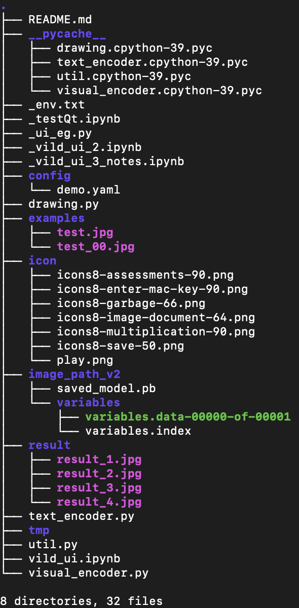

# zero_shot_object_detection
### GUI for ViLD, like just a very simple one.

.

To save the memory, README is simple.

| **examples/**  | the .jpg file as the original dataset |
| -------------- | ------------------------------------- |
| **icon/**      | Yes or No icon (in Qt)                |
| image_path_v2/ | Just as the tpu repo                  |
| **result/**    | image saved by UI                     |
| **tmp/**       | used by UI (in the Qt process)        |
| Vild_ui.ipynb  | Jupiter file to run                   |

I have tried to `pip freeze` to get the requirements.txt
